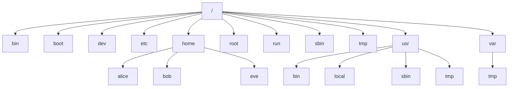

# Get Started with Red Hat Enterprise Linux

> An introduction to Linux, Red Hat Enterprise Linux, the command line, and file management fundamentals.

## Learning Objectives

- Explain the purpose of open source, Linux, Linux distributions, and Red Hat Enterprise Linux.
- Log in to a Linux system and run simple commands from the shell.
- Describe how Linux organizes files and manage them from the command line.

---

## 1. Understanding Linux and Its Origins

### A Brief History

Linux traces its lineage back to the UNIX operating system, developed through decades of incremental innovation:

- **1969** — Thompson and Ritchie create AT&T UNIX.
- **1972** — UNIX version 2 is rewritten in C.
- **1977** — BSD (Berkeley Software Distribution) is released.
- **1983** — Richard Stallman launches the GNU Project.
- **1987** — Andy Tannenbaum creates Minix.
- **1991** — Linus Torvalds creates i386 Linux.
- **1992** — Linux is licensed under the GPL (GNU General Public License).

**Key Takeaway:** Linux emerged from decades of UNIX development, combining Torvalds' kernel with the GNU Project's tools and the GPL's open licensing model.

### Linux Distributions

A **Linux distribution** (distro) packages the Linux kernel together with system tools, libraries, and software into a complete, installable operating system. Distributions descend from UNIX-inspired lineages and split into distinct families:

- **Debian family** → Ubuntu → Linux Mint
- **Fedora family** → RHEL → CentOS, Oracle Linux
- **SUSE family** → SLES → OpenSUSE
- Other distributions include Red Hat Linux, Fedora, and Kali Linux

All distributions share the same Linux kernel at their core, but differ in package management, target use case, and support model.

### Why Linux?

Linux's popularity across servers, desktops, and embedded systems comes from a combination of practical advantages:

- **Open Source** — source code is freely available and modifiable.
- **It is Free** — no licensing cost for most distributions.
- **High Security** — a strong permissions model and active security community.
- **High Stability** — long uptimes and reliable performance.
- **Ease of Maintenance** — centralized package management and scripting support.
- **Runs on Any Hardware** — from embedded devices to enterprise servers.
- **Customization** — deep configurability at every layer.
- **Community Support** — a large global base of contributors and users.
- **Education and Support** — extensive documentation and learning resources.

---

## 2. Linux Components

Linux systems are built from three core layers, each with a distinct role.

### Kernel

The **kernel** is the core of the operating system.

- Contains components such as device drivers.
- Loads into RAM when the machine boots.
- Stays resident in RAM until the machine powers off.

### Shell

The **shell** is the interface through which a user communicates with the kernel.

- Common shells include C shell, ksh, and Bash.
- **Bash** is the most commonly used shell on Linux.
- The shell parses commands entered by the user and translates them into logical segments executed by the kernel or other utilities.

> **Key Takeaway:** The kernel manages hardware and system resources, while the shell provides the interface users rely on to issue commands to that kernel.

---

## 3. Minimum Requirements for RHEL 9

Before installing RHEL 9, ensure the target system meets these minimums:

- **CPU:** Dual or quad core processor
- **RAM:** 2 GB or more
- **Disk space:** 20 GB or more
  - 10 GB for root (`/`)
  - 1 GB for swap
  - 4 GB for `/home`
  - 512 MB for `/boot`
- **Network:** Working network connection
- **Installation media** required

---

## 4. Access the Command Line

There are two primary ways to reach a Linux shell:

- **From a Graphical User Interface (GUI)** — opening a terminal application within a desktop environment such as GNOME.
- **Remote access over Secure Shell (SSH)** — connecting to the system from another machine.

### Running Commands

Commands in Linux follow a consistent syntax:

```bash
command [options] [arguments]
```

- Each item is separated by a space.
- **Options** modify the command's behavior.
- **Arguments** are file names or other information the command needs.
- Multiple commands can be separated with a semicolon (`;`).

### Example

```bash
usermod –L omar
```

### Command Syntax: Right vs. Wrong

Spacing matters. Options must be separated from the command and from each other correctly.

| Right | Wrong |
|---|---|
| `$ ls -l /dev` | `$ ls - l /dev` |
| `$ ls -a /dev` | `$ ls-a /dev` |
| `$ mail -s test root` | `$ mail test root -s` |
| `$ who -u` | `$ -u who` |
| `$ ls -l -d` | `$ ls -l-d` |
| `$ ls -ld` | `$ ls -l d` |

> **Important:** Options must be attached directly to their dash (no space between `-` and the letter), and the order of arguments relative to options matters for correct parsing.

### Shell Shortcuts

Bash provides keyboard shortcuts that save time when editing commands at the prompt:

| Shortcut | Action |
|---|---|
| `Ctrl+A` | Jump to the beginning of the command line. |
| `Ctrl+E` | Jump to the end of the command line. |
| `Ctrl+U` | Clear from the cursor to the beginning of the command line. |
| `Ctrl+K` | Clear from the cursor to the end of the command line. |
| `Ctrl+LeftArrow` | Jump to the beginning of the previous word on the command line. |
| `Ctrl+RightArrow` | Jump to the end of the next word on the command line. |
| `Ctrl+R` | Search the history list of commands for a pattern. |

---

## 5. Manage Files from the Command Line

Linux organizes all data in a single hierarchical tree of files and directories, rooted at `/`.

### The File System Hierarchy



Every directory branches from the single root (`/`), and each serves a specific, standardized purpose.

### Important Directories

| Location | Purpose |
|---|---|
| `/usr` | Installed software, shared libraries, include files, and read-only program data. |
| `/usr/bin` | User commands. |
| `/usr/sbin` | System administration commands. |
| `/usr/local` | Locally customized software. |
| `/etc` | Configuration files specific to this system. |
| `/var` | Variable data that persists between boots — databases, cache directories, log files, printer-spooled documents, and website content. |
| `/run` | Runtime data for processes started since the last boot, including process ID and lock files. Contents are recreated on reboot; this directory consolidates `/var/run` and `/var/lock` from earlier RHEL versions. |
| `/home` | Personal data and configuration files for regular users. |
| `/root` | Home directory for the administrative superuser, `root`. |
| `/tmp` | World-writable space for temporary files. Files untouched for 10 days are deleted automatically. |
| `/boot` | Files needed to start the boot process. |
| `/dev` | Special *device files* used by the system to access hardware. |

> **Note:** A second temporary directory, `/var/tmp`, also exists — files there are deleted automatically only after 30 days of inactivity, giving them a longer lifespan than files in `/tmp`.

### File Types

Every file in Linux has a type, indicated by a leading symbol in a long directory listing (`ls -l`):

| Symbol | Meaning |
|---|---|
| `-` | Regular file |
| `d` | Directory |
| `l` | Link |
| `c` | Special File |
| `s` | Socket |
| `p` | Named Pipe |
| `b` | Block Device |

### Rules for Naming Files

**Should:**
- Be descriptive.
- Use only alphanumeric characters: uppercase, lowercase, numbers, `@`, `_`.

**Should Not:**
- Include embedded blanks (spaces).
- Contain shell metacharacters: `* ? > < / ; & ! [ ] | \ ' " ( ) { }`

**Additional rules:**
- Filenames are case sensitive.
- Filenames starting with a `.` are hidden.
- Maximum filename length is 255 characters.

### Absolute Path vs. Relative Path

Every file and directory can be referenced two ways:

- **Absolute path** — the full path starting from the root `/`, unambiguous regardless of the current location (e.g., `/home/alice/document.txt` or `/var/log/messages`).
- **Relative path** — a path expressed relative to the current working directory, which changes depending on where you currently are in the file system.

> **Key Takeaway:** An absolute path always starts at `/` and works from anywhere; a relative path is shorter but only valid from your current location.

---

## 6. Inodes, Hard Links, and Soft Links

### What Is an Inode?

Linux allocates an **index node (inode)** for every file and directory in the filesystem. Inodes do not store the actual file data — instead, they store the metadata that points to where the file's data blocks live on disk.

### Metadata Stored in an Inode

- File type
- Permissions
- Hard links count
- Owner ID
- Group ID
- Soft/Hard Links
- Access Control List (ACLs)
- Size of file
- Timestamp (access time)
- Timestamp (modification time)

A **hard link** is a direct reference to a file's inode, while a **file** itself is also just a name pointing to an inode. A **soft link** does not reference the inode directly — it points to the file name/path instead, and both hard links and soft links are maintained by the file system.

### Soft Link vs. Hard Link

| Soft Link | Hard Link |
|---|---|
| An alias to the original file, similar to the shortcut feature in Windows OS. | The exact replica of the original file it is pointing to. |
| Contains only the location to the original file, not the actual data. | Contains the actual content of the file. |
| Has a different inode value pointing to the original value. | Shares the same inode value pointing to the same file location. |
| Can be created across filesystems. | Cannot be created outside the filesystem. |
| Becomes inaccessible when the original file is removed. | Changes in the hard-linked file will reflect in the other files. |
| Can link both to a file or a directory. | Can only link to a file, not a directory. |

> **Key Takeaway:** A hard link is another name for the exact same file data, while a soft link is a pointer to a file's location that breaks if the original is deleted.

---

## 7. Pattern Matching (Regex)

Bash supports pattern matching (globbing) to efficiently reference multiple files at once.

### Shell Pattern-Matching Symbols

| Pattern | Matches |
|---|---|
| `*` | Any string of zero or more characters. |
| `?` | Any single character. |
| `[abc...]` | Any one character in the enclosed class (between the square brackets). |
| `[!abc...]` | Any one character *not* in the enclosed class. |
| `[^abc...]` | Any one character *not* in the enclosed class. |
| `[[:alpha:]]` | Any alphabetic character. |
| `[[:lower:]]` | Any lowercase character. |
| `[[:upper:]]` | Any uppercase character. |
| `[[:alnum:]]` | Any alphabetic character or digit. |
| `[[:punct:]]` | Any printable character not a space or alphanumeric. |
| `[[:digit:]]` | Any single digit from 0 to 9. |
| `[[:space:]]` | Any single white space character. This may include tabs, newlines, carriage returns, form feeds, or spaces. |

### Regular Expressions

Regular expressions (regex) extend pattern matching with more powerful syntax, commonly used with tools like `grep` and `sed`:

| Symbol | Description |
|---|---|
| `.` | Replaces any character. |
| `^` | Matches start of string. |
| `$` | Matches end of string. |
| `*` | Matches zero or more times the preceding character. |
| `\` | Represents special characters. |
| `()` | Groups regular expressions. |
| `?` | Matches exactly one character. |

> **Key Takeaway:** Shell pattern matching (globbing) and regular expressions are related but distinct — globbing operates on filenames at the shell level, while regex is a more expressive matching language used inside text-processing tools.

---

## Key Takeaways

- Linux is an open-source operating system descended from UNIX, licensed under the GPL, with distributions (distros) built around a shared kernel but differing in packaging and tooling.
- The **kernel** manages hardware and resources; the **shell** (commonly Bash) is the interface for issuing commands.
- Commands follow the syntax `command [options] [arguments]`, and correct spacing between options is essential.
- Linux organizes everything into a single hierarchical filesystem rooted at `/`, with standardized directories like `/etc`, `/var`, `/home`, and `/tmp` serving specific purposes.
- Every file and directory has an **inode** storing its metadata; hard links share an inode with the original file, while soft links merely point to its path.
- Bash pattern matching and regular expressions allow efficient, flexible operations across many files at once.
