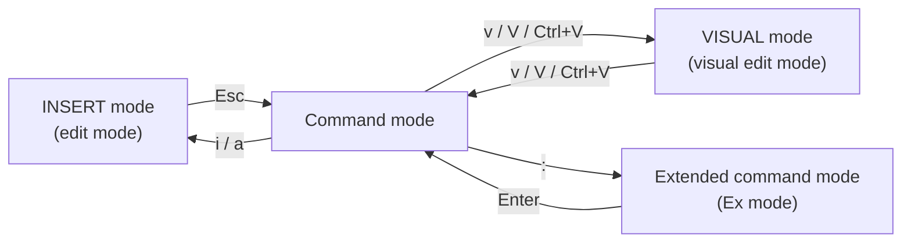

# Get Help, Manage Text Files, and Administer Local Users in Red Hat Enterprise Linux

> Resolving problems with local help systems, working with text files and shell redirection, and managing local users, groups, and password policies.

## Learning Objectives

- Find information in local Linux system manual pages.
- Redirect command output and errors to files, and chain commands with pipes.
- Create and edit text files from the command line with the vim editor.
- Set shell and environment variables to modify shell behavior.
- Create, manage, and delete local users and groups, and administer password policies.

---

## 1. Get Help in Red Hat Enterprise Linux

Linux systems ship with an extensive built-in reference: the manual pages (`man` pages). Knowing how to navigate them turns any unfamiliar command into a solvable problem.

### Manual Page Sections

The manual is divided into numbered sections, each covering a different category of documentation:

| Section | Content Type |
|---|---|
| 1 | User commands (both executable and shell programs) |
| 2 | System calls (kernel routines invoked from user space) |
| 3 | Library functions (provided by program libraries) |
| 4 | Special files (such as device files) |
| 5 | File formats (for many configuration files and structures) |
| 6 | Games (historical section for amusing programs) |
| 7 | Conventions, standards, and miscellaneous (protocols, file systems) |
| 8 | System administration and privileged commands (maintenance tasks) |
| 9 | Linux kernel API (internal kernel calls) |

### Structure of a Manual Page

Each man page follows a consistent internal structure, making it easy to jump straight to the information you need:

| Heading | Description |
|---|---|
| NAME | Subject name — usually a command or file name — with a very brief description. |
| SYNOPSIS | Summary of the command syntax. |
| DESCRIPTION | In-depth description to provide a basic understanding of the topic. |
| OPTIONS | Explanation of the command execution options. |
| EXAMPLES | Examples of how to use the command, function, or file. |
| FILES | A list of files and directories related to the man page. |
| SEE ALSO | Related information, normally other man page topics. |
| BUGS | Known bugs in the software. |
| AUTHOR | Information about who has contributed to the development of the topic. |

> **Key Takeaway:** Manual pages are organized by section and follow a predictable internal layout, so once you know the structure, finding the right information becomes fast and consistent.

---

## 2. Create, View, and Edit Text Files

Working efficiently at the command line means controlling where output goes and how commands connect to each other.

### Input-Output Redirection

Every running program or command has three standard communication channels, each identified by a file descriptor (FD) number:

- **Standard Input (stdin)** — `FD 0`, typically the keyboard.
- **Standard Output (stdout)** — `FD 1`, typically the screen.
- **Standard Error (stderr)** — `FD 2`, typically the screen, but separately from stdout.

These channels can be redirected to files instead of the terminal, letting you save output, discard errors, or feed input from a file.

### Pipelines

A **pipeline** connects the standard output (`stdout`) of one process directly to the standard input (`stdin`) of another, allowing commands to be chained together to process data in stages.


### Redirection Operators

| Operator | Behavior |
|---|---|
| `2>/dev/null` | Discard stderr error messages by redirecting them to `/dev/null`. |
| `>file 2>&1` or `&>file` | Redirect stdout and stderr to overwrite the same file. |
| `>>file 2>&1` or `&>>file` | Redirect stdout and stderr to append to the same file. |

### Example

```bash
command &> output.log
```

This redirects both stdout and stderr into `output.log`, overwriting any existing content.

### The vim Text Editor

**vim** is a modal command-line text editor — its behavior changes depending on which mode you're in.

#### Modes of vi/vim



- **Command mode** — the default mode for navigation and issuing editing commands.
- **Insert mode** — entered with `i` or `a`, used for typing text directly; return to command mode with `Esc`.
- **Visual mode** — entered with `v`, `V`, or `Ctrl+V`, used for selecting text.
- **Extended command mode (Ex mode)** — entered with `:`, used for saving, quitting, and advanced operations.

#### Common Ex Mode Commands

| Command | Action |
|---|---|
| `:wq` | Save and quit the current file. |
| `:x` | Save the current file if there are unsaved changes, then quit. |
| `:w` | Save the current file and remain in editor. |
| `:q` | Quit the current file (only if there are no unsaved changes). |
| `:q!` | Quit the current file, ignoring any unsaved changes. |
| `:10` | Jump to line number 10. |

#### Vim Cheat Sheet

Quick reference for moving between modes and performing common editing actions:

- **To edit mode:** `I`, `i`, `a`, `A` (variants of insert, positioned at line start, cursor, after cursor, or line end).
- **Cut, copy, paste line:** `dd` (cut/delete line), `yy` (yank/copy line), `p` (paste).
- **Delete char/word:** `x`, `X`, `dw`.
- **Join lines:** `J`.
- **Search, repeat:** `/` (search), `n` (repeat search).
- **Cursor movement:** `h` (left), `j` (down), `k` (up), `l` (right), `1G` (go to first line), `G` (go to last line), `$` (end of line).
- **Undo, redo:** `u` (undo), `.` (repeat last change).
- **Save & exit:** `ZZ`.
- **Ex mode:** `:` — includes search and replace (`:%s /old/new/g`), change settings (`:set ...`), and save/exit commands (`:w`, `:w!`, `:q`, `:q!`, `:wq`, `:x`).
- From Edit mode, `<Esc>` or `<Enter>` returns to Command mode.

> **Key Takeaway:** vim's power comes from its distinct modes — navigate and issue commands in Command mode, type freely in Insert mode, and save/quit/search through Ex mode.

### Variables in Linux

Linux shells support two categories of variables that control behavior and store data:

- **User-defined variables** — created and set by the user for their own use in scripts or commands.
- **Shell variables** — variables used or set by the shell itself to control its behavior and environment.

---

## 3. Manage Local Users and Groups

### What Is a User?

A **user account** provides security boundaries between different people and programs that can run commands. The system distinguishes user accounts by a unique identification number, the **user ID (UID)**.

There are three main types of user accounts:

- **Superuser** — the administrative account with full system privileges.
- **System users** — accounts used internally by system processes.
- **Regular users** — accounts for people who log in interactively.

### UID Ranges

UID ranges follow a standard convention on Red Hat systems:

- **UID 0** — always assigned to the superuser account, `root`.
- **UID 1–200** — a range of "system users" assigned statically to system processes by Red Hat.
- **UID 201–999** — a range of "system users" used by system processes that do not own files on the file system; typically assigned dynamically from the available pool when the software needing them is installed.
- **UID 1000+** — the range available for assignment to regular users.

### The /etc/passwd File

User account information is stored in `/etc/passwd`, with each line following a fixed colon-separated format:

```text
user01:x:1000:1000:User One:/home/user01:/bin/bash
```

Each field carries specific meaning:

1. **Username** for this user (`user01`).
2. **Password placeholder** — the encrypted password used to be stored here, but has moved to `/etc/shadow`. This field should always be `x`.
3. **UID number** for this user account (`1000`).
4. **GID number** for this user account's primary group (`1000`).
5. **Real name** for this user (`User One`).
6. **Home directory** for this user (`/home/user01`) — the initial working directory when the shell starts, containing the user's data and configuration settings.
7. **Default shell program** for this user, which runs on login (`/bin/bash`). For a regular user, this is normally the program providing the command-line prompt; a system user might use `/sbin/nologin` if interactive logins are not allowed.

### The /etc/group File

Group information is stored in `/etc/group`, also using a fixed colon-separated format:

```text
group01:x:10000:user01,user02,user03
```

1. **Group name** for this group (`group01`).
2. **Obsolete group password field** — should always be `x`.
3. **GID number** for this group (`10000`).
4. **Member list** — users who are members of this group as a supplementary group (`user01`, `user02`, `user03`).

### Primary Group and Supplementary Group

- When a new regular user is created, a new group with the same name as that user is created.
- That group becomes the **primary group** for the new user, and the user is the only member of this **User Private Group**.
- Users may also belong to **supplementary groups**.
- Membership in supplementary groups is determined by the `/etc/group` file.
- Users are granted access to files based on whether *any* of their groups — primary or supplementary — have access.

> **Key Takeaway:** A user's file access is the union of permissions granted to their primary group and every supplementary group they belong to.

### Superuser Privilege: su vs. sudo

Two commands grant superuser privilege, with different models of access:

- **`su`** — switches the current session directly to another user account (typically root), usually requiring that account's password.
- **`sudo`** — allows a permitted user to run a single command with superuser privileges, typically using their own password, without fully switching accounts.

### The /etc/shadow File

Password security information is stored separately in `/etc/shadow`, using this field structure:

```text
name:password:lastchange:minage:maxage:warning:inactive:expire:blank
```

1. **Login name**
2. **Encrypted password**
3. **Days since Jan 1, 1970** that the password was last changed
4. **Minimum days** before the password may be changed
5. **Maximum days** after which the password must be changed
6. **Days before expiration** that the user is warned
7. **Days after expiration** that the account is disabled
8. **Account expiration date**, represented as the number of days since 1970-01-01
9. **Blank field**, reserved for future use

### Configuring Password Aging with chage

The `chage` command manages password aging policy per user, controlling the timeline between password changes, warnings, and account deactivation:

- **`-d`** — sets the last change date.
- **`-m`** — sets minimum days between changes.
- **`-M`** — sets maximum days before a change is required.
- **`-W`** — sets the number of warning days before expiration.
- **`-I`** — sets the number of inactive days after expiration before the account is disabled.

### Example

```bash
chage -m 0 -M 90 -W 7 -I 14 user03
```

This sets `user03`'s password policy so it can be changed at any time (`-m 0`), must be changed at least every 90 days (`-M 90`), warns the user 7 days before expiration (`-W 7`), and disables the account after 14 days of inactivity past expiration (`-I 14`).

> **Key Takeaway:** Password aging policy is enforced through `/etc/shadow` fields and configured with `chage`, giving administrators fine-grained control over how often users must update their credentials.

---

## Key Takeaways

- Manual pages are organized into numbered sections and follow a predictable structure, making the `man` command a reliable first stop for troubleshooting.
- Shell redirection and pipes let commands read from and write to files or each other, using standard input, output, and error streams.
- vim is a modal editor — mastering the transitions between Command, Insert, Visual, and Ex modes is the key to using it efficiently.
- User and group information lives in `/etc/passwd` and `/etc/group`, while sensitive password data and aging policy live in `/etc/shadow`.
- Every regular user gets a private primary group at creation, and file access is determined by the combination of primary and supplementary group memberships.
- `su` switches users entirely, while `sudo` grants privileged access to individual commands — both provide paths to superuser privilege with different security trade-offs.
